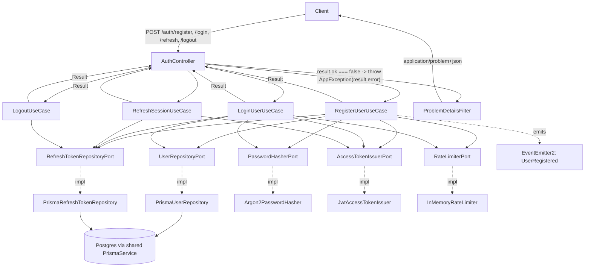

# BORA-21 Backend Auth Design

**Spec**: `.specs/features/bora-21-auth-backend/spec.md`
**Context**: `.specs/features/bora-21-auth-backend/context.md`
**Status**: Draft

This is the first slice of backend code in the repo (`apps/backend/src` currently only has a bare `AppController`/`AppModule`). It establishes the Identity & Access module and, by necessity, the shared scaffolding (Prisma, Zod validation, EventEmitter2, error handling) every future module will reuse — see `AD-003` in `.specs/STATE.md`, and the matching additions to the Tech Stack / Architecture & Modularity / Domain Model Confluence pages.

---

## Architecture Overview

Standard `domain → application → infrastructure` layering per `CLAUDE.md`, one bounded-context module (`identity/`). Rate limiting (per user decision) is a single hand-rolled in-memory mechanism used inline by both `LoginUseCase` (failure-counted, resets on success) and `RegisterUserUseCase` (flat per-IP count) — no `@nestjs/throttler` dependency.

**Errors are values.** Use-cases return `Result<T, AuthError>` for every expected outcome; nothing in `domain/` or `application/use-cases` throws. The controller is the one place that converts a `Result`'s error into NestJS's exception flow (via `AppException`), because Nest's non-2xx response pipeline is inherently exception-driven. One global filter turns every exception — `AppException` or otherwise — into an RFC 7807 Problem Details response.



---

## Code Reuse Analysis

### Existing Components to Leverage

| Component | Location | How to Use |
| --- | --- | --- |
| `validateEnv` fail-fast pattern | `apps/backend/src/env.ts` | Extend `BackendEnv`/`REQUIRED_KEYS` with `DATABASE_URL`, `JWT_ACCESS_SECRET` — same pattern, no new mechanism |
| `AppModule` bootstrap | `apps/backend/src/app.module.ts`, `main.ts` | Import `IdentityModule`, register global `EventEmitterModule.forRoot()`, register `ProblemDetailsFilter` as the app-wide filter (`app.useGlobalFilters(...)`), add `cookieParser()` middleware |

Everything else (Prisma, Zod pipe, EventEmitter2 wiring, argon2, JWT, rate limiter, the `Result`/`AppException`/Problem Details error system) is new — there is nothing else in the repo to reuse from. This ticket creates the reusable primitives future modules will build on.

### Integration Points

| System | Integration Method |
| --- | --- |
| Postgres | Single `apps/backend/prisma/schema.prisma`, shared `PrismaService` (global module), `identity/infrastructure` is the only code touching `User`/`RefreshToken` tables |
| NestJS EventEmitter2 | `EventEmitterModule.forRoot()` registered once in `AppModule`; `RegisterUserUseCase` emits `UserRegistered` after commit. No subscriber yet — Gamification module doesn't exist in code yet; this is forward-compatible plumbing only |

---

## Components

### `shared/result.ts`

- **Purpose**: The one `Result<T, E>` type every use-case in every module returns instead of throwing.
- **Location**: `apps/backend/src/shared/result.ts`
- **Interfaces**:
  - `type Result<T, E> = { ok: true; value: T } | { ok: false; error: E }`
  - `ok<T>(value: T): Result<T, never>`
  - `err<E>(error: E): Result<never, E>`
  - `unwrap<T, E extends AppError>(result: Result<T, E>): T` — throws `new AppException(result.error)` on the error branch; the single sanctioned call site per controller action.
- **Dependencies**: `AppError`, `AppException` (below)
- **Reuses**: n/a (first shared primitive)

### `shared/errors/`

- **Purpose**: The one exception type, the Problem Details envelope, and the error-code → HTTP status/title lookup.
- **Location**: `apps/backend/src/shared/errors/`
- **Interfaces**:
  - `interface AppError { code: string; detail?: string; meta?: Record<string, unknown> }` (`app-error.ts`)
  - `class AppException extends Error { constructor(readonly appError: AppError) }` (`app-exception.ts`) — the *only* class in the app that gets thrown for an expected error; anything else that throws is, by definition, unexpected.
  - `interface ErrorCatalogEntry { status: number; title: string }` and `ERROR_CATALOG: Record<string, ErrorCatalogEntry>` (`error-catalog.ts`) — merges `VALIDATION_ERROR_CATALOG`, `INTERNAL_ERROR_CATALOG`, and each module's own catalog (e.g. `AUTH_ERROR_CATALOG` from `identity/domain/errors/`)
- **Dependencies**: none
- **Reuses**: n/a

### `shared/filters/problem-details.filter.ts`

- **Purpose**: The single global `@Catch()` filter. Converts `AppException` (expected errors) and any other thrown value (unexpected errors — logged server-side, never detailed to the client) into one consistent `application/problem+json` body.
- **Location**: `apps/backend/src/shared/filters/problem-details.filter.ts`
- **Interfaces**: `@Catch() class ProblemDetailsFilter implements ExceptionFilter { catch(exception: unknown, host: ArgumentsHost): void }`
- **Dependencies**: `ERROR_CATALOG`, Pino logger (Tech Stack's existing logging choice) for the unexpected-exception branch
- **Reuses**: n/a

### `shared/validation/zod-validation.pipe.ts`

- **Purpose**: Generic `PipeTransform` that parses `@Body()` against a Zod schema. On failure, throws `AppException({ code: 'VALIDATION_FAILED', detail: 'Request validation failed', meta: { errors } })` — the one other sanctioned throw site in the app, because a Nest `PipeTransform` runs before the controller method and can only reject by throwing.
- **Location**: `apps/backend/src/shared/validation/zod-validation.pipe.ts`
- **Interfaces**: `class ZodValidationPipe implements PipeTransform { constructor(schema: ZodSchema); transform(value: unknown): unknown }`, used as `@UsePipes(new ZodValidationPipe(registerSchema))` per controller method.
- **Dependencies**: `zod`, `AppException`
- **Reuses**: n/a. (Decided against the `nestjs-zod` package — see Tech Decisions.)

### `shared/prisma/`

- **Purpose**: One Prisma client instance for the whole app, lifecycle-managed by Nest.
- **Location**: `apps/backend/src/shared/prisma/prisma.service.ts`, `prisma.module.ts`
- **Interfaces**: `PrismaService extends PrismaClient implements OnModuleInit, OnModuleDestroy`. `PrismaModule` is `@Global()`, exports `PrismaService`.
- **Dependencies**: `@prisma/client`
- **Reuses**: n/a

### `identity/domain/`

- **Purpose**: Plain TS aggregates, value objects, ports (interfaces), and this module's error codes. No Prisma/Nest imports, no throwing.
- **Location**: `apps/backend/src/identity/domain/`
- **Interfaces**:
  - `class Email` — constructor normalizes (lowercase + trim), `.value: string`, `.equals(other)`
  - `class Timezone` — constructor validates via `Intl.DateTimeFormat` (throws only as a last-resort *invariant* guard — the Zod schema already rejects bad input before this constructor ever sees it; see Tech Decisions), `.value: string`
  - `class User` — `{ id, email: Email, passwordHash: string, timezone: Timezone, createdAt: Date }`
  - `class RefreshToken` — `{ id, userId, tokenHash, expiresAt, revokedAt, createdAt }`
  - `interface UserRepositoryPort { findByEmail(email: Email): Promise<User | null>; create(data: NewUser): Promise<Result<User, AuthError>> }` — `create` returns a `Result` (its error branch is `AUTH_DUPLICATE_EMAIL`, from a caught Prisma `P2002`), it does not throw
  - `interface RefreshTokenRepositoryPort { create(data: NewRefreshToken): Promise<RefreshToken>; findByTokenHash(hash: string): Promise<RefreshToken | null>; revoke(id: string): Promise<void>; revokeAllActiveForUser(userId: string): Promise<void> }`
  - `interface PasswordHasherPort { hash(plain: string): Promise<string>; verify(hash: string, plain: string): Promise<boolean> }`
  - `interface AccessTokenIssuerPort { issue(payload: { sub: string }): string; verify(token: string): { sub: string } }`
  - `interface RateLimiterPort { isBlocked(key: string, opts: { max: number; windowMs: number }): boolean; recordAttempt(key: string, opts: { max: number; windowMs: number }): void; reset(key: string): void }`
  - `errors/auth-error.ts`: `type AuthErrorCode = 'AUTH_DUPLICATE_EMAIL' | 'AUTH_INVALID_CREDENTIALS' | 'AUTH_RATE_LIMITED' | 'AUTH_MISSING_REFRESH_TOKEN' | 'AUTH_INVALID_REFRESH_TOKEN' | 'AUTH_REFRESH_TOKEN_EXPIRED' | 'AUTH_REFRESH_TOKEN_REUSED'`, `interface AuthError extends AppError { code: AuthErrorCode }`, `AUTH_ERROR_CATALOG: Record<AuthErrorCode, ErrorCatalogEntry>` (see Error Handling Strategy for the full code table)
  - `class UserRegistered { userId: string; email: string; occurredAt: Date }`
- **Dependencies**: `shared/result.ts`, `shared/errors/app-error.ts`
- **Reuses**: n/a

Repository write methods that need multi-write atomicity (`create` on both repos, `revoke`) accept an optional Prisma transaction client so use-cases can compose them inside `prisma.$transaction(...)` (see Tech Decisions).

### `identity/application/`

- **Purpose**: Zod DTOs, use-cases (all returning `Result`), the controller (the only place that calls `unwrap`/throws), and named constants.
- **Location**: `apps/backend/src/identity/application/`
- **Interfaces**:
  - `auth.constants.ts` — `ACCESS_TOKEN_TTL_SECONDS = 15 * 60`, `REFRESH_TOKEN_TTL_MS = 30 * 24 * 60 * 60 * 1000`, `LOGIN_MAX_FAILED_ATTEMPTS = 5`, `LOGIN_WINDOW_MS = 15 * 60 * 1000`, `REGISTER_MAX_ATTEMPTS = 10`, `REGISTER_WINDOW_MS = 60 * 60 * 1000`, `REFRESH_COOKIE_NAME = 'refresh_token'`, `REFRESH_COOKIE_PATH = '/auth'`
  - `dto/register.schema.ts` — `registerSchema = z.object({ email: z.string().email(), password: z.string().min(8), timezone: z.string().refine(isValidIanaTimezone) }).strict()`
  - `dto/login.schema.ts` — `loginSchema = z.object({ email: z.string().email(), password: z.string().min(1) }).strict()`
  - `RegisterUserUseCase.execute(dto: RegisterDto, ip: string): Promise<Result<AuthSuccess, AuthError>>`
  - `LoginUserUseCase.execute(dto: LoginDto, ip: string): Promise<Result<AuthSuccess, AuthError>>`
  - `RefreshSessionUseCase.execute(rawToken: string | undefined): Promise<Result<AuthSuccess, AuthError>>`
  - `LogoutUseCase.execute(rawToken: string | undefined): Promise<void>` (logout has no failure branch worth surfacing — always idempotent success, see spec AC18)
  - `AuthController` — `POST /auth/register`, `/login`, `/refresh`, `/logout`; each action calls its use-case, then `const auth = unwrap(result)` (throws `AppException` on the error branch, caught by `ProblemDetailsFilter`), sets the refresh cookie via `@Res({ passthrough: true })`, and returns `{ accessToken }`
  - `AuthSuccess = { accessToken: string; refreshToken: string; refreshExpiresAt: Date }` (controller-internal shape; `refreshToken` never appears in the JSON body, only in `Set-Cookie`)
- **Dependencies**: domain ports (injected via Nest DI tokens), `EventEmitter2`, `shared/result.ts` (`unwrap`)
- **Reuses**: `shared/validation/zod-validation.pipe.ts`, `shared/result.ts`

### `identity/infrastructure/`

- **Purpose**: Prisma repositories + mappers, argon2 hasher, JWT issuer, opaque refresh-token generation/hashing, the in-memory rate limiter, module wiring.
- **Location**: `apps/backend/src/identity/infrastructure/`
- **Interfaces**:
  - `PrismaUserRepository implements UserRepositoryPort` — `create()` catches Prisma `P2002` on `email` and returns `err({ code: 'AUTH_DUPLICATE_EMAIL' })` instead of rethrowing
  - `PrismaRefreshTokenRepository implements RefreshTokenRepositoryPort`
  - `user.mapper.ts`, `refresh-token.mapper.ts` — Prisma row ⇄ domain object, both directions
  - `Argon2PasswordHasher implements PasswordHasherPort` — `argon2.hash(plain, { type: argon2.argon2id, memoryCost: 19456, timeCost: 2, parallelism: 1 })` (OWASP argon2id baseline); a precomputed `DUMMY_HASH` constant for the unknown-email timing-safe path
  - `refresh-token-generator.ts` — `generateRawToken(): string` (`crypto.randomBytes(32).toString('base64url')`), `hashToken(raw: string): string` (`crypto.createHash('sha256').update(raw).digest('hex')`)
  - `JwtAccessTokenIssuer implements AccessTokenIssuerPort` — thin wrapper over `@nestjs/jwt`'s `JwtService`, configured with `JWT_ACCESS_SECRET` + `ACCESS_TOKEN_TTL_SECONDS`
  - `InMemoryRateLimiter implements RateLimiterPort` — `Map<string, number[]>` of attempt timestamps per key; `isBlocked`/`recordAttempt` prune entries older than `windowMs` before counting
  - `IdentityModule` — wires everything, imports `PrismaModule`, `JwtModule.registerAsync(...)`
- **Dependencies**: `@prisma/client`, `argon2`, `@nestjs/jwt`, Node's built-in `crypto`
- **Reuses**: `shared/prisma/PrismaService`

---

## Data Models

### Prisma schema (`apps/backend/prisma/schema.prisma`)

```prisma
model User {
  id            String         @id @default(cuid())
  email         String         @unique
  passwordHash  String
  timezone      String
  createdAt     DateTime       @default(now())
  updatedAt     DateTime       @updatedAt
  refreshTokens RefreshToken[]
}

model RefreshToken {
  id        String    @id @default(cuid())
  userId    String
  user      User      @relation(fields: [userId], references: [id])
  tokenHash String    @unique
  expiresAt DateTime
  revokedAt DateTime?
  createdAt DateTime  @default(now())

  @@index([userId])
}
```

**Relationships**: One `User` has many `RefreshToken`. "Family" revocation (spec's AUTH-15) is scoped by `userId` directly — there is no separate lineage/family id, matching context.md's wording ("revoke every other active `RefreshToken` row belonging to that `userId`").

### Domain-layer mirror (`identity/domain/`, ORM-free)

```typescript
interface NewUser {
  email: Email;
  passwordHash: string;
  timezone: Timezone;
}

class User {
  constructor(
    readonly id: string,
    readonly email: Email,
    readonly passwordHash: string,
    readonly timezone: Timezone,
    readonly createdAt: Date,
  ) {}
}

class RefreshToken {
  constructor(
    readonly id: string,
    readonly userId: string,
    readonly tokenHash: string,
    readonly expiresAt: Date,
    readonly revokedAt: Date | null,
    readonly createdAt: Date,
  ) {}
}
```

### Shared error/result types (`shared/`)

```typescript
type Result<T, E> = { ok: true; value: T } | { ok: false; error: E };

interface AppError {
  code: string;
  detail?: string;
  meta?: Record<string, unknown>;
}

class AppException extends Error {
  constructor(readonly appError: AppError) {
    super(appError.code);
  }
}
```

---

## Response Shapes

### Success

| Endpoint | Status | Body | Cookie |
| --- | --- | --- | --- |
| `POST /auth/register` | `201` | `{ "accessToken": "<jwt>" }` | `Set-Cookie: refresh_token=<opaque>; HttpOnly; Secure; SameSite=None; Path=/auth; Max-Age=2592000` |
| `POST /auth/login` | `200` | `{ "accessToken": "<jwt>" }` | same shape, new value |
| `POST /auth/refresh` | `200` | `{ "accessToken": "<jwt>" }` | same shape, rotated value |
| `POST /auth/logout` | `204` | *(empty)* | `Set-Cookie: refresh_token=; Max-Age=0` (cleared) |

### Error — RFC 7807 Problem Details, always `Content-Type: application/problem+json`

Every non-2xx response from every endpoint (including validation failures and truly unexpected server errors) uses this exact envelope:

```typescript
interface ProblemDetails {
  type: string;     // `https://bora.dev/errors/${code}` — stable per code, not required to resolve to real docs
  title: string;     // short, stable human-readable summary for this code
  status: number;    // duplicates the HTTP status, per RFC 7807
  detail?: string;   // human-readable detail for this occurrence (carries the spec's exact wording, e.g. "Invalid email or password")
  instance?: string; // the request path, for log/support correlation
  code: string;      // stable machine-readable code — this is what client code should branch on
  errors?: Array<{ path: string; message: string }>; // present only for VALIDATION_FAILED
}
```

Example — wrong password:

```json
{
  "type": "https://bora.dev/errors/AUTH_INVALID_CREDENTIALS",
  "title": "Invalid email or password",
  "status": 401,
  "detail": "Invalid email or password",
  "instance": "/auth/login",
  "code": "AUTH_INVALID_CREDENTIALS"
}
```

Example — validation failure:

```json
{
  "type": "https://bora.dev/errors/VALIDATION_FAILED",
  "title": "Validation failed",
  "status": 400,
  "detail": "Request validation failed",
  "instance": "/auth/register",
  "code": "VALIDATION_FAILED",
  "errors": [{ "path": "password", "message": "String must contain at least 8 character(s)" }]
}
```

**Tasks-phase note**: acceptance tests must assert against `status` + `code` (and `detail` where the spec pins exact wording), not against a flat `{ statusCode, message }` shape — Nest's default error format is not used anywhere in this API.

---

## Error Handling Strategy

### `AUTH_ERROR_CATALOG` (`identity/domain/errors/auth-error.ts`)

| Code | HTTP Status | Title | Triggered by |
| --- | --- | --- | --- |
| `AUTH_DUPLICATE_EMAIL` | 409 | Email already registered | Pre-check hit, or `P2002` race caught in `PrismaUserRepository.create()` |
| `AUTH_INVALID_CREDENTIALS` | 401 | Invalid email or password | Unknown email or wrong password — both converge here |
| `AUTH_RATE_LIMITED` | 429 | Too many attempts | `rateLimiter.isBlocked()` true, checked before any DB/hasher work |
| `AUTH_MISSING_REFRESH_TOKEN` | 401 | Invalid session | No `refresh_token` cookie on the request |
| `AUTH_INVALID_REFRESH_TOKEN` | 401 | Invalid session | `findByTokenHash` found no row (covers unmatched value *and* a tampered/malformed cookie — both fail lookup identically, per the spec's edge case) |
| `AUTH_REFRESH_TOKEN_EXPIRED` | 401 | Invalid session | Row found, `expiresAt < now` |
| `AUTH_REFRESH_TOKEN_REUSED` | 401 | Invalid session | Row found already `revokedAt` set → triggers `revokeAllActiveForUser(userId)` as a side effect, then this error |

All refresh-path codes return the same `401` + generic "Invalid session" title/detail to the client (the spec never requires them to be indistinguishable the way login's anti-enumeration requirement does, but there's no reason to leak more than login does either); they exist as **distinct codes purely for server-side observability** — `AUTH_REFRESH_TOKEN_REUSED` in particular is a meaningful security signal worth its own Pino/Sentry tag (Tech Stack's per-module log/error tagging) since it indicates possible token theft.

Login's two failure paths (`AUTH_INVALID_CREDENTIALS` for both unknown-email and wrong-password) intentionally do **not** get split into two codes — that would reintroduce the enumeration signal AC8/AC9 explicitly forbid.

### Full flow

| Error Scenario | Handling | User Impact |
| --- | --- | --- |
| Duplicate email (sequential) | `findByEmail` pre-check before hashing → `err({ code: 'AUTH_DUPLICATE_EMAIL' })`, `hasher.hash()` never called | `409` |
| Duplicate email (concurrent race) | Prisma `P2002` caught in `PrismaUserRepository.create()`, converted to the same `Result` error (never rethrown) | `409`, no `500`, no duplicate row |
| Invalid Zod input | `ZodValidationPipe` throws `AppException({ code: 'VALIDATION_FAILED' })` before the controller method body runs | `400` with `errors[]` detail |
| Unknown email or wrong password | Both converge on `err({ code: 'AUTH_INVALID_CREDENTIALS' })`; unknown-email path still calls `hasher.verify(DUMMY_HASH, submittedPassword)` and discards the result | `401`, identical status/body/timing for both cases |
| Login rate-limited | Checked before any user lookup or hashing | `429`, no password verification attempted |
| Registration rate-limited | Checked before the duplicate-email pre-check | `429` |
| Refresh: missing / unmatched / tampered / expired / reused cookie | See `AUTH_ERROR_CATALOG` above | `401` in all cases, never `404` |
| Argon2 throws (e.g. OOM) | Hashing happens before any DB write; this is a genuinely unexpected failure — left to throw, caught by `ProblemDetailsFilter`'s fallback branch | `500`, `code: 'INTERNAL_ERROR'`, no partial `User` row, no detail leaked |
| Logout, no cookie present | Use-case returns success unconditionally (no `Result` error branch exists for logout) | `204` (idempotent) |

`ProblemDetailsFilter` is the single `@Catch()` sink: `AppException` → look up `appError.code` in `ERROR_CATALOG` for status/title; anything else (a real bug, Prisma/argon2 internals, Nest's own routing exceptions) → logged in full server-side via Pino, client gets `code: 'INTERNAL_ERROR'` and a generic detail, never a stack trace.

---

## Risks & Concerns

| Concern | Location (file:line) | Impact | Mitigation |
| --- | --- | --- | --- |
| The Result pattern's value depends entirely on discipline — it's easy for a future change to sneak a `throw` into a use-case instead of returning `err(...)`, silently reintroducing the exception-as-control-flow style this design deliberately avoids | `identity/application/use-cases/*.ts` (new files) | Inconsistent error handling creeps back in module-by-module | Keep exactly two sanctioned throw sites in the whole app (`ZodValidationPipe`, `unwrap()`/controller) — call this out in code review going forward; not enforceable by the type system alone in TS, so this is a process/review concern, not a fully mechanical one. |
| `Secure` + `SameSite=None` refresh cookies require HTTPS; most browsers won't send them over plain `http://localhost` | `identity/application/auth.controller.ts` (cookie-setting code, new) | A real browser hitting `http://localhost` may silently drop the cookie during local testing | Accepted for v1 per spec's explicit AC wording (no dev exception requested). Document that local browser testing needs HTTPS (e.g. a local reverse proxy) or curl/Postman, which don't enforce `Secure`. Revisit if BORA-22 frontend hits real friction. |
| `InMemoryRateLimiter`'s `Map` has one entry per distinct key with no upper bound or entry-count sweep beyond per-access pruning | `identity/infrastructure/rate-limit/in-memory-rate-limiter.ts` (new) | Unbounded memory growth under sustained unique-key traffic (e.g. an attacker cycling through many fake emails) | Accepted for weekend-scope MVP — Tech Stack already treats in-memory/reset-on-deploy as acceptable for v1. Revisit with a bounded LRU or scheduled sweep if this becomes a real issue. |
| In-memory rate limiting doesn't survive a process restart or (future) horizontal scaling | same file | A deploy or restart silently resets all counters; multiple instances wouldn't share state | Explicitly accepted per context.md/Tech Stack: single long-lived Railway process, no broker/cache in v1 stack. |
| No existing pattern in this repo for integration tests hitting a real Postgres (needed for AUTH-05's concurrent-race test and AUTH-15's family-revocation test — not meaningfully testable against mocks) | `apps/backend` (no test-DB harness exists yet) | Risk of the Tasks phase under-speccing how tests get a real, resettable Postgres instance | Tasks phase must define the test-DB strategy explicitly (e.g. a docker-compose Postgres service + per-run migrate/truncate) before writing AUTH-05/AUTH-15 tests. |
| First use of Prisma/JWT in this repo; `apps/backend/src/env.ts`'s `REQUIRED_KEYS` doesn't yet know about `DATABASE_URL`/`JWT_ACCESS_SECRET` | `apps/backend/src/env.ts:5` | App would only fail at first DB/JWT call, not at boot, if these are missing | Extend `BackendEnv`/`REQUIRED_KEYS` in the same file with both new vars — same fail-fast pattern (Tasks-phase item). |

---

## Tech Decisions

| Decision | Choice | Rationale |
| --- | --- | --- |
| Error handling model | `Result<T, E>` returned by every use-case; exactly two sanctioned throw sites in the whole app (`ZodValidationPipe`, `unwrap()`/controller); every HTTP error response is RFC 7807 Problem Details via one global `ProblemDetailsFilter` | Confirmed with user. Makes each use-case's possible outcomes explicit in its return type instead of hidden in `throw` control flow; standardizes on an IETF-standard error envelope (`type/title/status/detail` + a `code` extension clients actually switch on) instead of Nest's default `{statusCode,message,error}` shape. |
| Error code namespacing | `<MODULE>_<REASON>` (e.g. `AUTH_*`), each module owns its own `{module}-error-catalog.ts`, merged into one `ERROR_CATALOG` in `shared/errors/` | Keeps each module's error vocabulary local and reviewable while still giving the filter one place to resolve status/title from any code. |
| Refresh-path error granularity | Five distinct `AUTH_*` codes for missing/invalid/expired/reused, all mapped to the same `401` | The client never needs to distinguish them (all just mean "log in again"), but `AUTH_REFRESH_TOKEN_REUSED` specifically is worth its own code for security observability (Sentry/Pino tagging on a likely-theft signal) — collapsing it into a single generic code would throw away that signal for no client-facing benefit. |
| Login error granularity | One code (`AUTH_INVALID_CREDENTIALS`) for both unknown-email and wrong-password | Splitting these would reintroduce exactly the enumeration signal AC8/AC9 forbid; unlike the refresh case, there's no legitimate observability reason to distinguish them since both are equally likely to be a normal user typo. |
| Rate limiting mechanism | Hand-rolled `InMemoryRateLimiter` (one `RateLimiterPort`) used inline by both login and register use-cases | Confirmed with user. `@nestjs/throttler` counts every request against a limit; it has no built-in way to count only *failed* attempts and reset on success (AUTH-10/AUTH-11), so it can't fully satisfy login's AC without a workaround. |
| Zod integration | Small custom `ZodValidationPipe`, not the `nestjs-zod` package | `nestjs-zod` adds DTO-class conventions we don't need for 2 endpoints' worth of schemas; a ~15-line pipe covers `.strict()` schemas and now also wraps failures as `AppException` to fit the Problem Details envelope. |
| Refresh token format | Opaque random token (`crypto.randomBytes(32)`, base64url), stored as its sha256 hash, looked up via a unique DB index | Per context.md, refresh tokens are DB-persisted, not stateless JWTs. sha256 is correct here because the token is already high-entropy random data, not a low-entropy password — a fast deterministic hash enables O(1) indexed lookup, which a salted KDF would not. |
| "Family" revocation scope | Directly by `userId` — no separate `familyId` column | AUTH-15/context.md both say "every other active `RefreshToken` row belonging to that `userId`" — a `userId`-scoped revoke is exactly that. |
| Timezone validation | `new Intl.DateTimeFormat('en-US', { timeZone: tz })` try/catch inside the Zod `.refine()` | More accurate than `Intl.supportedValuesOf('timeZone').includes(tz)` — the latter's canonical list misses some IANA aliases still accepted at runtime by `DateTimeFormat`. |
| Argon2 parameters | `argon2id`, `memoryCost: 19456` (19 MiB), `timeCost: 2`, `parallelism: 1` | OWASP Password Storage Cheat Sheet's argon2id baseline; explicit params rather than the package default (`argon2i` unless overridden). |
| JWT payload | `{ sub: userId }` only (no email) | Keeps the access token minimal; avoids a user-table lookup on the refresh path just to populate an unused claim. |
| Repository transactional composition | Write methods accept an optional Prisma transaction client, defaulting to the injected `PrismaService` | Registration (create `User` + create initial `RefreshToken`) and refresh (revoke old + create new) must be atomic pairs — the standard Prisma+NestJS pattern for composing multi-repository writes inside `prisma.$transaction(...)`. |

**Project-level decisions recorded**: `.specs/STATE.md` `AD-003` now captures the Result/Problem-Details/error-catalog convention alongside Prisma/argon2/rate-limiter, since every future backend module follows it. The Tech Stack, Architecture & Modularity, and Domain Model Confluence pages have matching updates (see below).

---

## Documentation Updated

- `.specs/STATE.md` — `AD-003` rewritten to describe the `Result`/`AppException`/`ProblemDetailsFilter`/error-catalog convention (superseding the earlier draft that used a thrown `DomainError` hierarchy).
- `CLAUDE.md` — `shared/` folder-tree comment extended to mention the error-handling primitives.
- Confluence **Tech Stack** — new "Error Handling" section under API Contract.
- Confluence **Architecture & Modularity** — `shared/` folder-tree comment updated to match CLAUDE.md.
- Confluence **Domain Model** — `Habit.complete()` sketch updated from `throw new Error(...)` to `Result`, with a note pointing at the new convention, so the next module built (Productivity) doesn't contradict it.
- `spec.md`/`context.md` — no changes needed; every AC's required status code and message text is still satisfied (the message lives in Problem Details' `detail` field).

---

## Tips applied

- Context.md's locked decisions (rotation-on-every-refresh, generic login errors, in-scope rate limiting, logout scope) are all reflected directly above, not re-litigated.
- The one genuine architectural fork (rate limiting) was confirmed with the user before detailing components; the error-handling model (Result + Problem Details) was proposed and confirmed in the same way before this rewrite.
