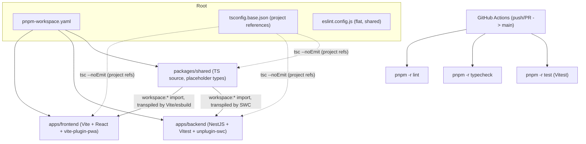

# Repo + Project Scaffolding Design

**Spec**: `.specs/features/bora-3-repo-scaffolding/spec.md`
**Status**: Draft

---

## Architecture Overview

A pnpm workspaces monorepo with three packages linked via the `workspace:*` protocol. `packages/shared` is consumed as raw TS source by both apps — no build/watch step — so edits are picked up on the next dev-server restart. Each app's own bundler/runtime does the TS transpilation (Vite/esbuild for the frontend, SWC for the backend via Vitest); a repo-root `tsc --noEmit` pass using TypeScript project references is the only place where the three packages are typechecked together.

### Approach chosen (and rejected alternatives)

| Approach | Verdict | Why |
| --- | --- | --- |
| **Source-linked shared package, no build step** (chosen) | ✅ Recommended, confirmed with user | Matches spec edge case (shared changes picked up on dev-server restart, no manual build/publish). One less background process to babysit in a solo-dev workflow. |
| Build-step shared package (`tsc` emits `dist/`) | ❌ Rejected | Requires a persistent `tsc --watch` alongside both dev servers; contradicts the spec's explicit no-manual-build-step requirement (SCAF-04 / Edge Cases). |
| Nx / Turborepo task-graph orchestration | ❌ Rejected | Explicitly excluded by the ticket for v1 ("no Turborepo/Nx"). |

---

## Code Reuse Analysis

### Existing Components to Leverage

None — `C:\Workspace\bora` is currently an empty directory with no git history and no code. This is the foundational scaffolding ticket; there is nothing yet to reuse.

### Integration Points

| System | Integration Method |
| --- | --- |
| GitHub remote (`https://github.com/souzapablo/bora`) | `git init` locally, `git remote add origin`, initial commit + push. Repo already exists on GitHub, so no `gh repo create` needed. |
| GitHub Actions | Workflow file at `.github/workflows/ci.yml`, triggered on `push`/`pull_request` to `main`. |

---

## Components

### Root workspace config

- **Purpose**: Declares the workspace members and shared tooling config that all three packages build on.
- **Location**: repo root (`pnpm-workspace.yaml`, `package.json`, `tsconfig.base.json`, `eslint.config.js`, `.nvmrc`, `.gitignore`, `.env.example`-per-app convention documented in root `README.md`)
- **Interfaces**:
  - `pnpm-workspace.yaml` — declares `apps/*` and `packages/*` as workspace members
  - root `package.json` scripts: `lint` → `eslint .`, `typecheck` → `tsc --build tsconfig.base.json`, `test` → `pnpm -r --parallel test` (fans out to each app's Vitest script)
  - `packageManager` field pins the exact pnpm version (resolved via `corepack use pnpm@latest-9` at setup time)
- **Dependencies**: Corepack (ships with Node 22), pnpm
- **Reuses**: N/A (nothing pre-existing)

### `packages/shared`

- **Purpose**: Placeholder workspace package proving cross-package linking works; will hold real DTOs/Zod schemas once the API contract is decided (separate ticket).
- **Location**: `packages/shared/`
- **Interfaces**:
  - `packages/shared/src/index.ts` exports one placeholder, e.g. `export type Placeholder = unknown;`
  - Consumed as `@bora/shared` via `workspace:*` from both apps
- **Dependencies**: TypeScript only (no runtime deps)
- **Reuses**: N/A

### `apps/frontend`

- **Purpose**: Vite + React + TypeScript app configured as an installable PWA.
- **Location**: `apps/frontend/`
- **Interfaces**:
  - `pnpm --filter frontend dev` — dev server with PWA dev support enabled
  - `pnpm --filter frontend build` — production build (not part of this ticket's CI, but must not error)
  - `pnpm --filter frontend test` — Vitest
- **Dependencies**: `vite`, `@vitejs/plugin-react`, `vite-plugin-pwa` (**pinned to `>= 0.11.13`** — the first version supporting the dev-mode installability check), `@bora/shared` (workspace)
- **Reuses**: root `tsconfig.base.json` via `extends`, root ESLint flat config (frontend-specific block)
- **Tech note**: `vite-plugin-pwa` must be configured with `devOptions: { enabled: true }` in `vite.config.ts` — without it, the service worker/manifest are only generated on production build, and the spec's "installable as a PWA" AC (SCAF-02) cannot be verified against the dev server. ([vite-pwa-org.netlify.app/guide/development](https://vite-pwa-org.netlify.app/guide/development))

### `apps/backend`

- **Purpose**: NestJS app that boots with no domain modules yet, beyond the default bootstrap.
- **Location**: `apps/backend/`
- **Interfaces**:
  - `pnpm --filter backend start:dev` — Nest dev server (watch mode)
  - `pnpm --filter backend test` — Vitest
- **Dependencies**: `@nestjs/core`, `@nestjs/common`, `@nestjs/platform-express`, `vitest`, `unplugin-swc`, `@swc/core`, `@bora/shared` (workspace)
- **Reuses**: root `tsconfig.base.json`, root ESLint flat config (backend-specific block)
- **Tech note**: Vitest's default transform (esbuild) does not support `emitDecoratorMetadata`, which NestJS's dependency injection relies on. `unplugin-swc` must be added as a Vitest plugin (`swc.vite({ module: { type: 'es6' } })` in `vitest.config.ts`), with `experimentalDecorators`/`emitDecoratorMetadata: true` in `tsconfig.json` and `decoratorMetadata: true` in the SWC transform config — otherwise DI silently breaks or tests fail to resolve providers. ([blog.ablo.ai/jest-to-vitest-in-nestjs](https://blog.ablo.ai/jest-to-vitest-in-nestjs), [zenn.dev/maronn/articles/nestjs-vitest-migrate](https://zenn.dev/maronn/articles/nestjs-vitest-migrate?locale=en))

### CI workflow

- **Purpose**: Runs lint, typecheck, and test on every push/PR to `main`.
- **Location**: `.github/workflows/ci.yml`
- **Interfaces**: One workflow, one job, three sequential steps (`lint` → `typecheck` → `test`) — no matrix, since two apps don't justify parallel-job overhead at this scale.
- **Dependencies**: `pnpm/action-setup`, `actions/setup-node` (Node 22, cache: `pnpm`), Corepack
- **Reuses**: root-level `pnpm -r` scripts defined in root workspace config (single source of truth — CI doesn't re-implement per-app commands)

---

## Data Models

N/A — this ticket has no persistence layer. Database/Prisma setup is explicitly out of scope (separate ticket per spec).

---

## Error Handling Strategy

| Error Scenario | Handling | User Impact |
| --- | --- | --- |
| pnpm version mismatch (Corepack not activated / wrong pnpm version) | `packageManager` field + Corepack enforce the pinned version; install fails fast with pnpm's own version-mismatch error | Clear error naming the expected vs. installed pnpm version, no silent fallback |
| Missing `.env.development` or missing required var | Each app validates required env vars at bootstrap (frontend: Vite's `import.meta.env` + a small runtime check; backend: Nest `ConfigModule` with `validationSchema` or manual check) and throws on startup if any documented-in-`.env.example` var is absent | Dev server refuses to boot with a named missing-variable error, instead of running in an undefined state |
| CI step failure (lint/typecheck/test) | Each step is a separate workflow step; a non-zero exit from any step fails the job immediately (`continue-on-error: false`, the default) | Commit/PR shows a red X with the specific failing step highlighted in the Actions log |
| NestJS DI breaks under Vitest due to missing decorator metadata | Mitigated at design time via `unplugin-swc` (see `apps/backend` tech note) — not a runtime error class to handle, but flagged here since it's the most likely first failure mode when scaffolding the backend | N/A if configured correctly per this design; if misconfigured, tests fail with Nest's "Nest can't resolve dependencies" error |

---

## Risks & Concerns

| Concern | Location (file:line) | Impact | Mitigation |
| --- | --- | --- | --- |
| NestJS + Vitest decorator-metadata incompatibility (esbuild doesn't emit `emitDecoratorMetadata`) | `apps/backend/vitest.config.ts` (to be created) | DI silently fails to resolve providers, or tests fail to instantiate modules | Use `unplugin-swc` as a Vitest transform plugin with `decoratorMetadata: true`; verified via research, not just assumption (see `apps/backend` tech note above) |
| `vite-plugin-pwa` dev-mode installability is version-gated (only `>= 0.11.13`) | `apps/frontend/package.json` (dependency version) | If an older/pinned version is installed, SCAF-02's dev-server PWA-installability check cannot pass, and this would only surface manually in DevTools, not in CI | Pin `vite-plugin-pwa` to `^0.11.13` or later explicitly in `apps/frontend/package.json`; set `devOptions: { enabled: true }` in `vite.config.ts` |
| No automated CI check for PWA installability (spec marks this as a manual DevTools check, per Assumptions table) | N/A — process gap, not code | A regression that breaks PWA installability would only be caught if a human manually checks DevTools; it will not fail CI | Accepted per spec's Assumptions & Open Questions (flagged as "confirm later if automated check wanted"); no design-level fix needed unless spec is amended |
| No branch protection / required status checks on `main` (solo-dev repo) | GitHub repo settings, not code | CI can be green or red without blocking a merge, since there's no reviewer gate | Explicitly out of scope per spec's Out of Scope table; acceptable for a solo-dev trunk-based workflow at this stage |

> All identified concerns have a mitigation; none are blocking for this design.

---

## Tech Decisions (only non-obvious ones)

| Decision | Choice | Rationale |
| --- | --- | --- |
| Shared package consumption | Source-linked via `workspace:*`, no build step; TS project references used only for `tsc --noEmit` orchestration | Confirmed with user; matches spec's no-manual-build-step edge case; avoids a persistent watch process in a solo-dev setup |
| Backend test runner integration | Vitest + `unplugin-swc` (not Vitest's default esbuild transform) | Required for NestJS DI (`emitDecoratorMetadata`) to work under Vitest — confirmed via research, not just assumed |
| Frontend PWA dev support | `vite-plugin-pwa@^0.11.13+` with `devOptions.enabled: true` | Only way to satisfy SCAF-02 (installable-as-PWA check against the **dev** server, not just a production build) |
| CI job structure | Single job, three sequential steps (lint → typecheck → test), no matrix | Two apps don't justify the overhead/complexity of a parallel job matrix at this scale; sequential steps also fail fast on the earliest, cheapest check (lint) before paying for typecheck/test |
| ESLint composition | Single root `eslint.config.js` (flat config) with a shared base block plus path-scoped overrides (`apps/frontend/**` gets React rules, `apps/backend/**` gets NestJS-friendly rules) | Confirmed with user; avoids duplicating base rules (import ordering, TS-recommended) across two per-app config files |
| Node/pnpm pinning | Node 22 LTS via `.nvmrc` + `engines.node`; pnpm pinned via `packageManager` field + Corepack | Confirmed with user; guarantees CI and local dev use identical toolchain versions |

No project-level `AD-NNN` decisions are being recorded yet — `.specs/STATE.md` doesn't exist. Once this design is approved, the two decisions worth promoting to project-level (source-linked shared packages with no build step, and single-root-flat-config ESLint) should be logged as the first `AD-001`/`AD-002` entries in `.specs/STATE.md`, since every future feature touching `packages/shared` or adding lint rules must conform to them.

---

## Tips

- Load context first — no `context.md` exists for this feature (Specify phase didn't trigger `discuss.md`; gray areas were resolved inline via `AskUserQuestion`).
- Confirm before Tasks — this design needs your approval before moving to the Tasks breakdown.
