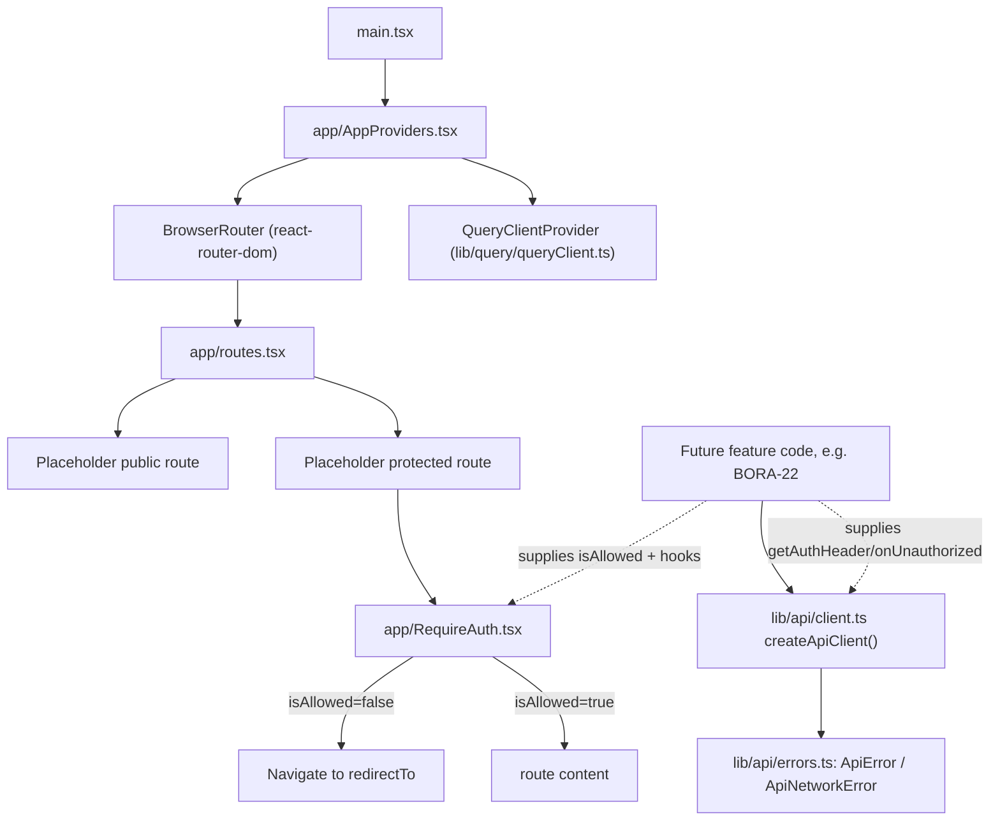

# Frontend: App Shell, Router, API Client, TanStack Query Setup (BORA-30) Design

**Spec**: `.specs/features/bora-30-frontend-app-shell-infra/spec.md`
**Status**: Draft

---

## Architecture Overview

Three independent, composable layers, wired together once at the root:



**Key property**: `app/` and `lib/` never import from `features/*`. Every auth-shaped decision (what "authenticated" means, how to refresh a token) is injected from outside as a plain value or callback — `RequireAuth` takes `isAllowed: boolean`, the API client takes `getAuthHeader`/`onUnauthorized`. This keeps BORA-30 fully reusable and matches the existing backend discipline (modules never reach into each other) applied to the frontend.

---

## Code Reuse Analysis

### Existing Components to Leverage

| Component | Location | How to Use |
| --------- | -------- | ---------- |
| `validateEnv()` | `apps/frontend/src/env.ts` | API client reads `import.meta.env.VITE_API_URL` — already validated at boot; client does not re-validate. |
| `@bora/shared` workspace package | `packages/shared/src/index.ts` | Currently only a placeholder type; API client does not depend on it yet (no real schemas to import). Future features will import DTOs from here for response typing at their own call sites. |

### Integration Points

| System | Integration Method |
| ------ | ------------------- |
| Backend Problem Details responses | `lib/api/errors.ts` decodes `application/problem+json` bodies (`type/title/status/detail` + `code` extension) per the backend's `ProblemDetailsFilter` (AD-003) into `ApiError`. |
| Backend refresh-cookie auth | API client always sends `credentials: "include"` so the httpOnly `refresh_token` cookie round-trips; the client never reads/writes it directly. |

---

## Components

### `app/AppProviders.tsx`

- **Purpose**: Single root component wiring `BrowserRouter` + `QueryClientProvider` (+ dev-only Query Devtools) around the route table.
- **Location**: `apps/frontend/src/app/AppProviders.tsx`
- **Interfaces**:
  - `AppProviders(): JSX.Element` — no props; owns no state itself.
- **Dependencies**: `react-router-dom` (`BrowserRouter`), `@tanstack/react-query` (`QueryClientProvider`), `lib/query/queryClient.ts`, `app/routes.tsx`.
- **Reuses**: nothing existing (greenfield).

### `app/routes.tsx`

- **Purpose**: Central, single-file route table. The one place a future feature registers a new route.
- **Location**: `apps/frontend/src/app/routes.tsx`
- **Interfaces**:
  - `AppRoutes(): JSX.Element` — renders `<Routes>` with one placeholder public route (`/login`, a stub element) and one placeholder protected route (`/`, wrapped in `RequireAuth`).
- **Dependencies**: `react-router-dom` (`Routes`, `Route`), `app/RequireAuth.tsx`.
- **Reuses**: n/a.

### `app/RequireAuth.tsx`

- **Purpose**: Generic auth-gate wrapper — redirects to a caller-supplied path when a caller-supplied check is false.
- **Location**: `apps/frontend/src/app/RequireAuth.tsx`
- **Interfaces**:
  - `RequireAuth(props: { isAllowed: boolean; redirectTo: string; children: ReactNode }): JSX.Element` — renders `children` if `isAllowed`, else `<Navigate to={redirectTo} replace />`.
- **Dependencies**: `react-router-dom` (`Navigate`).
- **Reuses**: n/a. **Zero imports from `features/*`** — this is the contract the spec requires (ROUTER-02).

### `lib/query/queryClient.ts`

- **Purpose**: One documented `QueryClient` instance with project-wide defaults.
- **Location**: `apps/frontend/src/lib/query/queryClient.ts`
- **Interfaces**:
  - `export const queryClient: QueryClient` — constructed with `defaultOptions.queries = { retry: 1, refetchOnWindowFocus: false }`.
- **Dependencies**: `@tanstack/react-query`.
- **Reuses**: n/a.

### `lib/api/errors.ts`

- **Purpose**: Typed error classes the API client rejects with, so callers can `instanceof`-discriminate.
- **Location**: `apps/frontend/src/lib/api/errors.ts`
- **Interfaces**:
  - `class ApiError extends Error { code: string; status: number; detail?: string }`
  - `class ApiNetworkError extends Error {}`
- **Dependencies**: none.
- **Reuses**: n/a.

### `lib/api/client.ts`

- **Purpose**: Thin typed `fetch` wrapper: builds requests, decodes Problem Details, exposes auth extension points.
- **Location**: `apps/frontend/src/lib/api/client.ts`
- **Interfaces**:
  - `createApiClient(options?: { getAuthHeader?: () => string | undefined; onUnauthorized?: () => Promise<boolean> }): { request<T>(path: string, init?: RequestInit): Promise<T> }`
  - `export const apiClient = createApiClient()` — the default, hook-less instance BORA-30 itself uses/tests.
- **Dependencies**: `lib/api/errors.ts`, `import.meta.env.VITE_API_URL`.
- **Reuses**: n/a.

---

## Data Models

### `ApiError` (thrown/rejected, not a domain model)

```typescript
class ApiError extends Error {
  constructor(
    public code: string,      // e.g. "AUTH_DUPLICATE_EMAIL", or "UNKNOWN" for undecodable bodies
    public status: number,    // HTTP status
    public detail?: string,   // RFC7807 "detail", if present
  ) { super(code); }
}

class ApiNetworkError extends Error {}
```

**Relationships**: Every rejected `request<T>()` call rejects with exactly one of these two types (never a raw `Response`/generic `Error`/parse exception) — enforced by API-02/03/04.

---

## Error Handling Strategy

| Error Scenario | Handling | User Impact (surfaced to caller) |
| -------------- | -------- | --------------------------------- |
| Non-2xx, valid `application/problem+json` body | Parse body, reject `new ApiError(body.code, response.status, body.detail)` | Caller gets a typed, catalog-mapped error code to branch on. |
| Non-2xx, malformed/non-JSON/wrong-content-type body | Reject `new ApiError("UNKNOWN", response.status)` | Caller can still show a generic fallback; no thrown parse exception escapes. |
| `fetch()` itself rejects (offline/DNS/CORS) | Catch, reject `new ApiNetworkError(...)` | Caller distinguishes "couldn't reach server" from a real backend error. |
| 2xx, invalid JSON body | Reject `new ApiError("UNKNOWN", response.status)` (same path as malformed error body — a 2xx with unparseable JSON is still an unexpected-shape response) | Caller doesn't crash on `.json()` throwing. |
| 401 with `onUnauthorized` hook supplied | Call hook; if resolves `true`, retry original request once; else reject `ApiError` as normal | BORA-22 plugs refresh-and-retry here; BORA-30 has no opinion on what the hook does. |
| 401 with no hook | Reject `ApiError` immediately (same as any other non-2xx) | No special behavior without a feature opting in. |

---

## Risks & Concerns

| Concern | Location | Impact | Mitigation |
| ------- | -------- | ------ | ---------- |
| No de-duplication of concurrent `onUnauthorized` calls | `lib/api/client.ts` (`request()`) | If BORA-22 naively calls `/auth/refresh` inside `onUnauthorized` and several requests 401 at once, multiple concurrent refresh calls could fire (each likely still succeeds against the backend, but it's wasteful and a rotating-refresh-token backend could make later ones fail). | Explicitly logged as BORA-22's responsibility in spec.md Assumptions and here; BORA-22's own design should consider an in-flight-refresh-promise guard. Not solved in BORA-30 since there is no refresh call here to reason about. |
| Existing `App.tsx` / `App.test.tsx` become dead code once `main.tsx` renders `AppProviders` | `apps/frontend/src/App.tsx`, `App.test.tsx` | A stale placeholder component + its test would sit unused, or the test would start failing if `main.tsx` changes what mounts. | Task 1 removes `App.tsx`/`App.test.tsx` and replaces their role with `AppProviders` + a `RequireAuth` unit test — no orphaned code. |
| Query Devtools bundled into production | `app/AppProviders.tsx` | Larger prod bundle, dev-only UI shipped to users. | Guard with `import.meta.env.DEV` and a dynamic `import()` so Vite tree-shakes/code-splits it out of the prod build (DEVTOOLS-01). |

> No security, correctness, or test-coverage gaps found beyond the above — this is greenfield infra with no prior code to inherit debt from.

---

## Tech Decisions (only non-obvious ones)

| Decision | Choice | Rationale |
| -------- | ------ | --------- |
| Router library | React Router v7, **component mode** (`<BrowserRouter>`/`<Routes>`), not the data-router (`createBrowserRouter`) mode | User-confirmed. No route needs a loader/action yet — TanStack Query owns all server-state fetching, so data-router mode would add ceremony with no payoff today. |
| HTTP client | Native `fetch` wrapper, no Axios/ky/other dependency | User-confirmed. Matches the project's general "stay implementation-agnostic, avoid unnecessary vendor surfaces" preference — `fetch` is a browser standard, not a vendor to swap out. |
| Auth coupling | `RequireAuth` and the API client both take **plain values/callbacks** (`isAllowed`, `getAuthHeader`, `onUnauthorized`) rather than importing anything identity-specific | Mirrors the backend's module-boundary discipline (Architecture & Modularity) on the frontend: `app/` and `lib/` stay reusable infra; `features/identity` (BORA-22) is the only place that knows what "authenticated" means. |
| Query client defaults | `retry: 1`, `refetchOnWindowFocus: false` | User-confirmed. Avoids hammering a flaky network with TanStack's default 3 retries; avoids surprise refetches when a mobile PWA resumes from background. |

> **Project-level decisions**: Router library, HTTP client choice, and the auth-extension-point pattern are conventions every future frontend feature will follow — recorded as `AD-005` in `.specs/STATE.md` and reflected in the Tech Stack / Frontend Architecture & Components Confluence pages.
