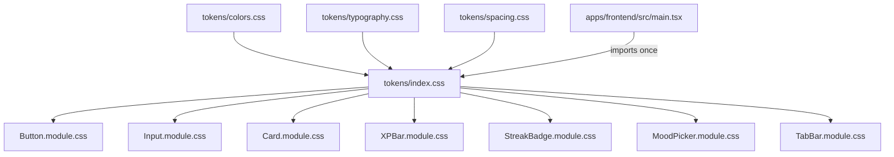

# Design System: Tokens + Core Components Design

**Spec**: `.specs/features/bora-8-design-system/spec.md`
**Status**: Draft

---

## Architecture Overview

Two layers, tokens below components, no runtime dependency between them beyond CSS custom properties:

1. **Tokens layer** — plain CSS files under `apps/frontend/src/design-system/tokens/`, split by category (`colors.css`, `typography.css`, `spacing.css`), aggregated by `tokens/index.css`. Values live as custom properties on `:root` (shared/neutral) and `[data-theme="light"]` (theme-mode-specific). No dark values yet — `[data-theme="dark"]` is a documented empty slot, not a block that exists.
2. **Component layer** — one folder per component under `apps/frontend/src/design-system/components/`, each a `.tsx` + colocated `.module.css` pair. Components only ever reference tokens via `var(--token-name)`; they import `tokens/index.css` once (via a barrel) and never define a raw color/size value themselves.

There is no build-time token pipeline (no Style Dictionary, no JS token objects) — Vite serves CSS custom properties natively, and the frontend has no styling library installed (`apps/frontend/package.json` — confirmed in spec Assumptions). Keeping tokens as plain CSS is the smallest thing that satisfies "components reference tokens, not hardcoded values."

`tokens/index.css` is imported exactly once, in `main.tsx` (global stylesheet, like a CSS reset). Component `.module.css` files reference `var(--token-name)` without re-importing — CSS custom properties cascade from `:root`/`[data-theme]` automatically, so no explicit import wiring is needed per component.

---

## Code Reuse Analysis

### Existing Components to Leverage

| Component | Location | How to Use |
| --- | --- | --- |
| Vite CSS Modules support | built into `vite` (already a devDependency) | Zero-config `.module.css` — no new dependency needed |
| Vitest + Testing Library | `apps/frontend/package.json` devDependencies | Component tests render via `@testing-library/react`, already wired in `App.test.tsx` as a pattern to follow |

### Integration Points

| System | Integration Method |
| --- | --- |
| `apps/frontend/src/main.tsx` | Add a single `import "./design-system/tokens/index.css"` at the top, alongside existing global setup |
| Future Phase 2 screens | Import components as `import { Button } from "@/design-system/components/Button"` (barrel export per component) |

No existing frontend code to reuse beyond tooling — `apps/frontend/src` currently only has `App.tsx`/`main.tsx` scaffolding (confirmed by directory listing).

---

## Components

### Tokens: `colors.css`

- **Purpose**: Neutral/base palette + two contextual accent sub-palettes (habit/RPG, mood/calm)
- **Location**: `apps/frontend/src/design-system/tokens/colors.css`
- **Interfaces** (custom property namespaces, exact values chosen during implementation):
  - `--color-neutral-{0-900}` — shared base scale (backgrounds, text, borders), defined on `:root`
  - `--color-accent-habit-{50,100,...,900}` or semantic steps (`-default`, `-hover`, `-muted`) — habit/RPG accent, defined on `:root`
  - `--color-accent-mood-{...}` — mood/calm accent, same shape as habit, visually distinct hue
  - `--color-semantic-danger`, `--color-semantic-success` etc. — cross-cutting semantic colors not tied to either tone
  - Theme-mode-sensitive values (e.g. `--color-surface`, `--color-text`) redeclared under `[data-theme="light"]` so a future `[data-theme="dark"]` block can override them without touching neutral/accent scales
- **Dependencies**: none
- **Reuses**: n/a (new file)

### Tokens: `typography.css`

- **Purpose**: Named type scale (heading/body/caption roles)
- **Location**: `apps/frontend/src/design-system/tokens/typography.css`
- **Interfaces**: `--font-family-base`, `--font-size-{heading-1,heading-2,body,caption}`, `--font-weight-{regular,medium,bold}`, `--line-height-{tight,normal,relaxed}` — exact scale values chosen during implementation
- **Dependencies**: none
- **Reuses**: n/a (new file)

### Tokens: `spacing.css`

- **Purpose**: Named spacing scale
- **Location**: `apps/frontend/src/design-system/tokens/spacing.css`
- **Interfaces**: `--space-{1,2,3,4,...}` numbered steps on a consistent base unit (base unit chosen during implementation)
- **Dependencies**: none
- **Reuses**: n/a (new file)

### Tokens: `index.css`

- **Purpose**: Single aggregation point — the only token file anything else imports
- **Location**: `apps/frontend/src/design-system/tokens/index.css`
- **Interfaces**: `@import "./colors.css"; @import "./typography.css"; @import "./spacing.css";`
- **Dependencies**: the three files above
- **Reuses**: n/a

### Component: `Button`

- **Purpose**: Primary interactive control, shared across all modules
- **Location**: `apps/frontend/src/design-system/components/Button/` (`Button.tsx`, `Button.module.css`, `index.ts`, `Button.test.tsx`)
- **Interfaces**:
  - `type ButtonVariant = "primary" | "secondary" | "danger"`
  - `type ButtonState = "default" | "hover" | "disabled" | "loading"` — `hover` is a CSS `:hover` pseudo-state, not a prop; `disabled`/`loading` are props (`disabled?: boolean`, `loading?: boolean`) since they affect behavior, not just appearance
  - `Button(props: { variant?: ButtonVariant; size?: "sm" | "md" | "lg"; disabled?: boolean; loading?: boolean; children: ReactNode; onClick?: () => void }): JSX.Element`
- **Dependencies**: `tokens/colors.css`, `tokens/spacing.css`, `tokens/typography.css` (via `var()`)
- **Reuses**: none (first component)

### Component: `Input`

- **Purpose**: Text input control
- **Location**: `apps/frontend/src/design-system/components/Input/`
- **Interfaces**:
  - `type InputState = "default" | "focused" | "error" | "disabled"` — `focused` via CSS `:focus`, `error`/`disabled` via props
  - `Input(props: { error?: boolean; disabled?: boolean; placeholder?: string; value: string; onChange: (v: string) => void }): JSX.Element`
- **Dependencies**: color + spacing tokens
- **Reuses**: shares the same variant/state prop pattern as `Button`

### Component: `Card`

- **Purpose**: Generic content container; demonstrates the contextual-accent architecture
- **Location**: `apps/frontend/src/design-system/components/Card/`
- **Interfaces**:
  - `type CardAccent = "neutral" | "habit" | "mood"`
  - `Card(props: { accent?: CardAccent; children: ReactNode }): JSX.Element`
- **Dependencies**: neutral + both accent color token namespaces
- **Reuses**: accent-prop pattern is reused by `XPBar`/`StreakBadge` (habit) and `MoodPicker` (mood)

### Component: `XPBar`

- **Purpose**: Gamification progress indicator
- **Location**: `apps/frontend/src/design-system/components/XPBar/`
- **Interfaces**:
  - `XPBar(props: { progress: number /* 0–100 */ }): JSX.Element` — empty/partial/full are derived from `progress`, not separate props (0 = empty, 100 = full, else partial)
- **Dependencies**: `--color-accent-habit-*`, spacing tokens
- **Reuses**: habit accent namespace from `Card`

### Component: `StreakBadge`

- **Purpose**: Gamification streak indicator
- **Location**: `apps/frontend/src/design-system/components/StreakBadge/`
- **Interfaces**:
  - `StreakBadge(props: { active: boolean; count: number }): JSX.Element`
- **Dependencies**: `--color-accent-habit-*`
- **Reuses**: habit accent namespace

### Component: `MoodPicker`

- **Purpose**: Mental Health module's mood selection control
- **Location**: `apps/frontend/src/design-system/components/MoodPicker/`
- **Interfaces**:
  - `type Mood = "great" | "good" | "okay" | "low" | "bad"` (exact set confirmed against Mental Health domain during implementation; placeholder here)
  - `MoodPicker(props: { options: Mood[]; selected?: Mood; onSelect: (m: Mood) => void }): JSX.Element`
- **Dependencies**: `--color-accent-mood-*`
- **Reuses**: mood accent namespace from `Card`

### Component: `TabBar`

- **Purpose**: Cross-module bottom/top navigation chrome
- **Location**: `apps/frontend/src/design-system/components/TabBar/`
- **Interfaces**:
  - `TabBar(props: { tabs: { id: string; label: string }[]; activeId: string; onSelect: (id: string) => void }): JSX.Element`
- **Dependencies**: neutral tokens only (no accent — cross-module chrome per spec DSYS-13)
- **Reuses**: none tone-specific

---

## Data Models (if applicable)

Not applicable — this ticket has no persistence, no domain entities, and touches only `apps/frontend`. No backend module boundary is crossed (`CLAUDE.md` module rules don't apply here).

---

## Error Handling Strategy

| Error Scenario | Handling | User Impact |
| --- | --- | --- |
| `MoodPicker` receives a `selected` value not present in `options` | Render with no option visually selected (defensive, no throw) | No selection shown; caller bug, not a crash |
| `XPBar` receives `progress` outside 0–100 | Clamp to `[0, 100]` before rendering | Bar never visually overflows or goes negative |
| `TabBar` receives `activeId` not present in `tabs` | Render with no tab visually active (defensive, no throw) | No active tab shown; caller bug, not a crash |

---

## Risks & Concerns

| Concern | Location (file:line) | Impact | Mitigation |
| --- | --- | --- | --- |
| No styling library/convention exists yet in `apps/frontend` — this ticket is the first to establish one | `apps/frontend/package.json` | Choosing CSS Modules here sets the convention every future frontend ticket inherits | Documented explicitly as a Tech Decision below; if wrong, it's cheap to change now (7 components) vs. later (whole app) |
| DSYS-05/DSYS-14 ("no hardcoded values") is easy to violate silently since CSS isn't statically typed | any `*.module.css` | A stray hardcoded hex/px value wouldn't fail TypeScript compilation | Add a lint/test check (see Tech Decisions) that greps component `.module.css` files for raw color/size literals outside `var()` |
| `MoodPicker`'s exact mood set isn't defined anywhere yet (no Mental Health domain code exists in `apps/backend` to check) | n/a — greenfield | Risk of inventing a mood taxonomy that doesn't match a future backend `MoodEntry` shape | Treat `Mood` type as a placeholder; flag explicitly in the component's task so it's revisited if `MoodEntry`'s domain values differ later |

---

## Tech Decisions (only non-obvious ones)

| Decision | Choice | Rationale |
| --- | --- | --- |
| Styling mechanism | CSS Modules (`.module.css`), not Tailwind/CSS-in-JS | Zero new dependencies; Vite supports it natively; smallest thing that works. First-ever styling decision for this frontend — see Risks. |
| Token format | Plain CSS custom properties, not a JS/TS token object or Style Dictionary pipeline | No design-tool export to sync anymore (Figma/Canva dropped); CSS custom properties are consumed directly by CSS Modules with zero tooling |
| Hover/focus states | Expressed as CSS pseudo-classes (`:hover`, `:focus`), not component props | They're not meaningfully different render trees — only `disabled`/`loading`/`error` (behavioral states) become props |
| "No hardcoded values" enforcement | A per-component test (or a single repo-wide script) asserts each `.module.css` file contains no literal `#hex`/`rgb(`/bare `px` values outside `var()` calls | DSYS-05/DSYS-14 need a mechanical check, not just code review, since nothing else in the toolchain enforces it |
| `XPBar`/`TabBar` variant expression | Derived from data props (`progress`, `activeId`) rather than an explicit `variant` enum | These states are naturally continuous/data-driven, not a fixed style choice like `Button`'s `variant` |

> **Project-level decision**: The CSS Modules choice and the token-as-plain-CSS choice both set conventions every future frontend ticket inherits. Recording as `AD-001` in `.specs/STATE.md` since no `STATE.md` exists yet.

---

## Tips

(n/a — reference section, not filled per-feature)
